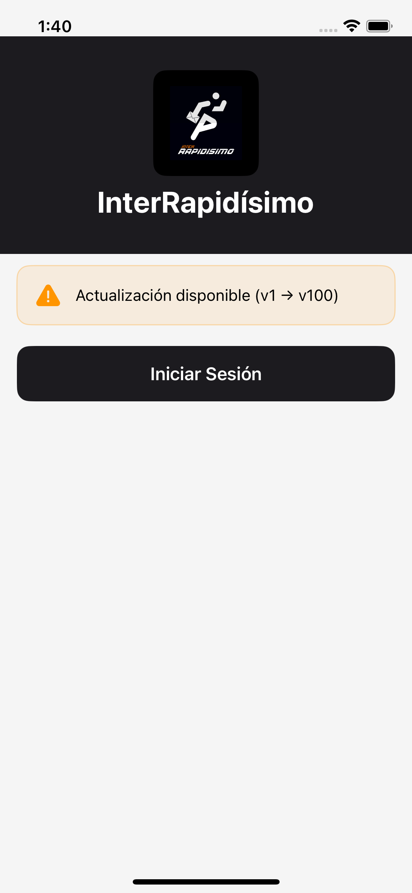
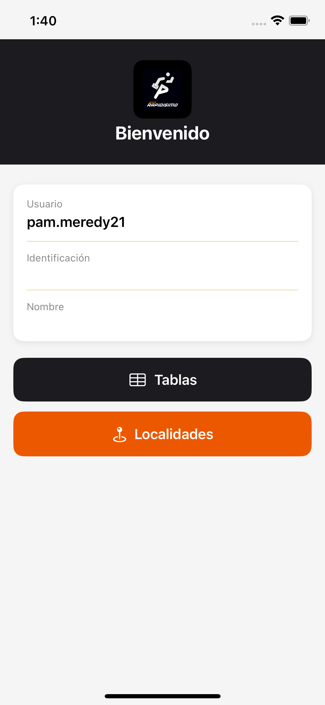
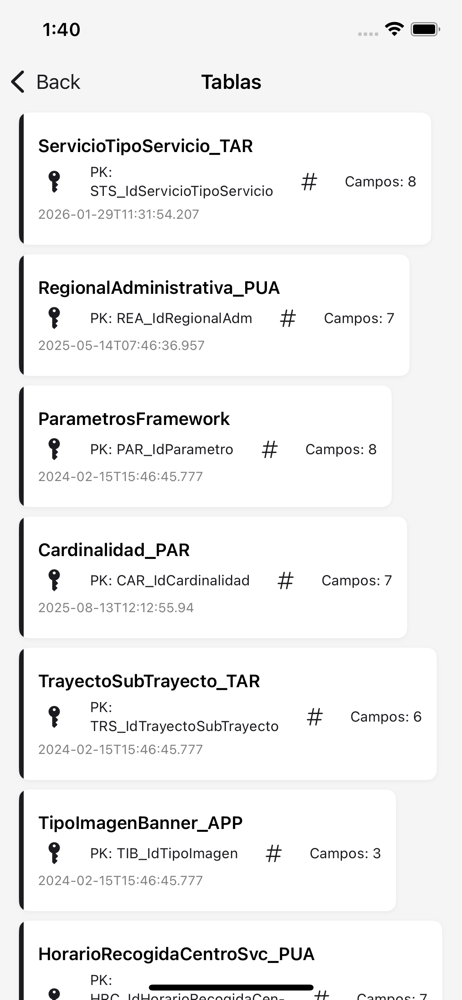
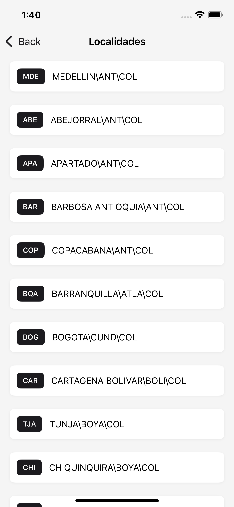

# InterRapidísimo — Prueba Técnica Android

Aplicación Android nativa desarrollada como prueba técnica para **InterRapidísimo**. Implementa autenticación de usuarios, verificación de versión remota, sincronización de esquema de tablas y consulta de localidades, siguiendo principios de **Clean Architecture** y el patrón **MVVM**.

---

## Pantallas

<table>
  <tr>
    <td align="center"><b>Login — Alerta de versión</b></td>
    <td align="center"><b>Login — Pantalla principal</b></td>
    <td align="center"><b>Home</b></td>
    <td align="center"><b>Tablas</b></td>
    <td align="center"><b>Localidades</b></td>
  </tr>
  <tr>
    <td></td>
    <td></td>
    <td></td>
    <td></td>
    <td></td>
  </tr>
</table>

---

## Stack tecnológico

| Categoría | Tecnología |
|---|---|
| Lenguaje | Kotlin 2.0.21 |
| UI | Jetpack Compose + Material 3 |
| Arquitectura | Clean Architecture + MVVM |
| Inyección de dependencias | Hilt 2.51.1 |
| Base de datos local | Room 2.6.1 |
| Red | Retrofit 2.11.0 + OkHttp 4.12.0 |
| Serialización | Gson |
| Navegación | Navigation Compose 2.8.5 |
| Build | AGP 8.13.2 / KSP 2.0.21-1.0.28 |

---

## Arquitectura

El proyecto adopta **Clean Architecture** dividida en tres capas con separación estricta de responsabilidades:

```
┌─────────────────────────────────────────┐
│            Presentation Layer           │
│   Screens (Compose) · ViewModels · UI   │
│              State / Events             │
└───────────────┬─────────────────────────┘
                │ usa casos de uso
┌───────────────▼─────────────────────────┐
│              Domain Layer               │
│  Use Cases · Repository Interfaces      │
│          Domain Models · Either         │
└───────────────┬─────────────────────────┘
                │ implementa interfaces
┌───────────────▼─────────────────────────┐
│               Data Layer                │
│  Repository Impls · Remote API · Room   │
│           DTOs · Entities · DAOs        │
└─────────────────────────────────────────┘
```

### Patrones aplicados

| Patrón | Dónde se aplica |
|---|---|
| **MVVM** | `ViewModel` expone `UiState` como `StateFlow`; la pantalla Compose lo observa con `collectAsStateWithLifecycle` |
| **Repository** | Interfaz en `domain`, implementación en `data`; la capa de presentación nunca accede a Retrofit ni Room directamente |
| **Use Case** | Una clase, una responsabilidad (`LoginUseCase`, `SyncTablesUseCase`, etc.) |
| **Either / Result** | `Either<DomainError, T>` como tipo de retorno de repositorios y casos de uso, evitando excepciones en flujo normal |
| **Dependency Injection** | Hilt provee los grafos de dependencias; módulos separados por responsabilidad (`NetworkModule`, `DatabaseModule`, `RepositoryModule`) |
| **DTO → Domain Mapper** | Los DTOs de red y entidades de Room se convierten a modelos de dominio antes de cruzar la frontera de capas |
| **Dual Retrofit** | Dos instancias `@Named("framework")` y `@Named("security")` con base URLs distintas |

---

## Estructura del proyecto

```
app/src/main/java/com/kenny/interrapidisimotest1/
│
├── AppConfig.kt                      # Versión local, URLs base
├── InterrapidisimoApp.kt             # Application class (Hilt)
├── MainActivity.kt
│
├── data/
│   ├── local/
│   │   ├── dao/
│   │   │   ├── TableDao.kt
│   │   │   └── UserDao.kt
│   │   ├── db/
│   │   │   └── AppDatabase.kt
│   │   └── entity/
│   │       ├── TableEntity.kt
│   │       └── UserEntity.kt
│   ├── remote/
│   │   ├── api/
│   │   │   └── InterApi.kt
│   │   ├── dto/
│   │   │   ├── AuthRequestDto.kt
│   │   │   ├── AuthResponseDto.kt
│   │   │   ├── LocalityDto.kt
│   │   │   └── TableSchemeDto.kt
│   │   └── mapper/
│   │       ├── HttpErrorMapper.kt
│   │       └── DefaultHttpErrorMapper.kt
│   └── repository/
│       ├── AuthRepositoryImpl.kt
│       ├── LocalityRepositoryImpl.kt
│       ├── TableRepositoryImpl.kt
│       └── VersionRepositoryImpl.kt
│
├── di/
│   ├── DatabaseModule.kt
│   ├── MapperModule.kt
│   ├── NetworkModule.kt
│   └── RepositoryModule.kt
│
├── domain/
│   ├── model/
│   │   ├── DomainError.kt
│   │   ├── Either.kt             # Either<L, R> propio
│   │   ├── Locality.kt
│   │   ├── Table.kt
│   │   ├── User.kt
│   │   └── VersionStatus.kt
│   ├── repository/
│   │   ├── AuthRepository.kt
│   │   ├── LocalityRepository.kt
│   │   ├── TableRepository.kt
│   │   └── VersionRepository.kt
│   └── usecase/
│       ├── CheckVersionUseCase.kt
│       ├── GetLocalitiesUseCase.kt
│       ├── GetStoredUserUseCase.kt
│       ├── GetTablesUseCase.kt
│       ├── LoginUseCase.kt
│       └── SyncTablesUseCase.kt
│
└── ui/
    ├── common/
    │   ├── DomainErrorExt.kt
    │   ├── ErrorDialog.kt
    │   ├── ErrorMessage.kt
    │   └── LoadingOverlay.kt
    ├── home/
    │   ├── HomeScreen.kt
    │   └── state/
    │       ├── HomeUiState.kt
    │       └── HomeViewModel.kt
    ├── localities/
    │   ├── LocalidadesScreen.kt
    │   └── state/
    │       ├── LocalitiesUiState.kt
    │       └── LocalitiesViewModel.kt
    ├── login/
    │   ├── LoginScreen.kt
    │   └── state/
    │       ├── LoginUiEvent.kt
    │       ├── LoginUiState.kt
    │       └── LoginViewModel.kt
    ├── navigation/
    │   ├── AppNavGraph.kt
    │   └── Screen.kt
    ├── tables/
    │   ├── TablasScreen.kt
    │   └── state/
    │       ├── TablasViewModel.kt
    │       └── TablesUiState.kt
    └── theme/
        ├── Color.kt
        ├── Theme.kt
        └── Type.kt
```

---

## Flujo de la aplicación

```
Inicio
  │
  ├─► Verificación de versión (API)  ──┐
  └─► Usuario almacenado (Room)  ──────┤  (en paralelo)
                                       │
              ┌────────────────────────┘
              │
      ¿Usuario guardado?
         │           │
        SÍ           NO
         │           │
         ▼           ▼
       Home      Login Screen
                 (card de versión +
                  botón Iniciar Sesión)
                      │
                      ▼
                 POST autenticación
                      │
                      ▼
                    Home
                 ┌────┴────┐
                 ▼         ▼
              Tablas   Localidades
          (sync API  (fetch API
          → Room     directo,
          → lista)    lista)
```

---

## Base de datos local (Room v1)

| Tabla | Campos clave |
|---|---|
| `user` | `username` (PK), `identification`, `name` |
| `tables_schema` | `tableName` (PK), `description`, `keyFields`, `active`, `serverName`, `databaseName` |

---

## Branding

| Token | Color |
|---|---|
| Primary | `#003876` (azul corporativo) |
| Secondary | `#E30613` (rojo) |
| Accent | `#FFD100` (amarillo) |
| Background | `#F5F5F5` |

---

## Requisitos

- Android Studio Hedgehog o superior
- JDK 17
- Android SDK mínimo: API 24 (Android 7.0)
- Conexión a los servidores de InterRapidísimo (VPN si aplica)